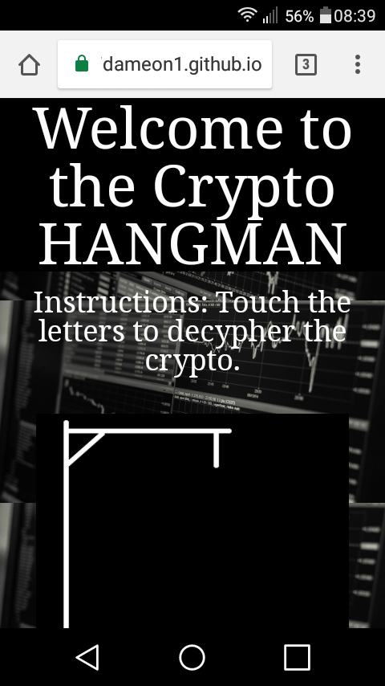
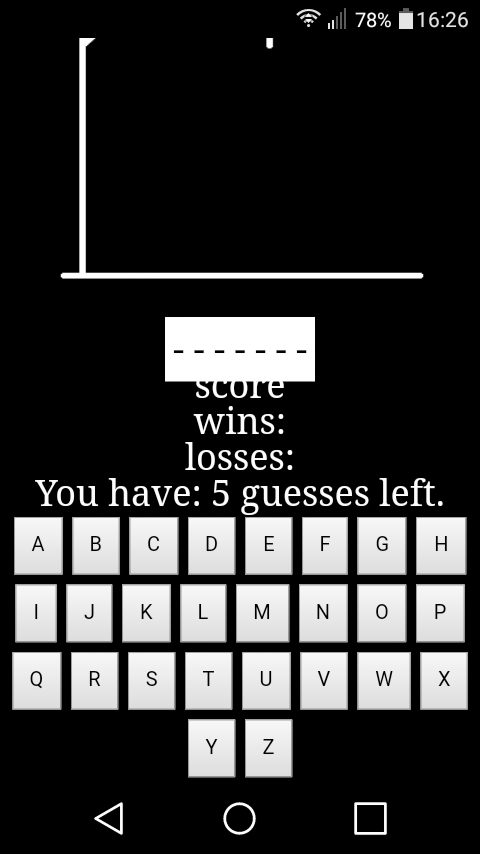
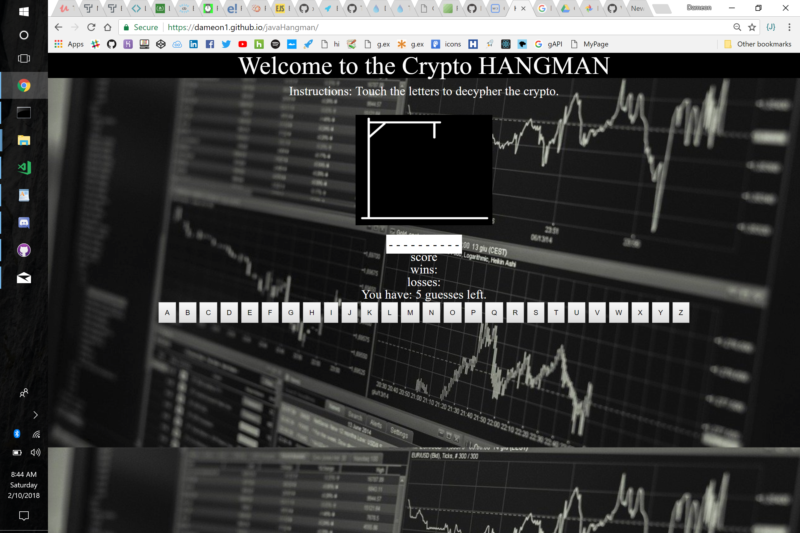

#Try your hand at cryptoHangman

#Application details
-This is Hangman.
-Navigating to the **[where to find page] will reveal a layout of a welcome, instructions, an image for the hangman,
score tracking and buttons of the alphabet.
-Users can either click or tap a letter to try to find the hidden cryptoCurrency that is randomly chosen.
-Keeps a continuos score to track how well the user does.
*#Warning 
    **this game is not easy

##Where to find
This is where the working game resides **[HERE](https://dameon1.github.io/javaHangman/)!

##Instructions
 -A random word is chosen to start the game.
 -Choose a letter that you think is in the word.
    -If the letter is in the word,
      You are one step closer to solving the word.
    -If the letter is not in the word,
      You will get a new piece of the man in the noose.
-Reveal the word to gain a win score.
-You have 5 chances to avoid hanging and freeing your man.
-Run out of chances and your man will end up in the noose.

##Coding styles
I used two different styles to code the HTML.
-*JavaScript to perform loops, "if" statements, and a couple of getElemnetById's.
-*jQuery to make use of an easy to use catalog of options of changing the *HTML.

##Screenshot
Two screenshots.
-First one is what it looks like on mobile screens

-Second screenshot is on a full sized screen

  

##Contributions
Contributions to the word bank are accepted. Please use all capital letters to maintain the ease of comparing inside the actual code.
If you have a design suggestion, I stayed with a simple Black & White design and will accept any improvements along those color lines.
If you have *Xcode experience and can make it accessible for iOS users if would be appreciated.

##Credits
WorldCoinIndex.com is where I found the list of words of the top 100 coins by volume

##Author
* **Dameon Mendoza** - *JavaScipt/jQuery* - [Dameon Mendoza](https://github.com/Dameon1)